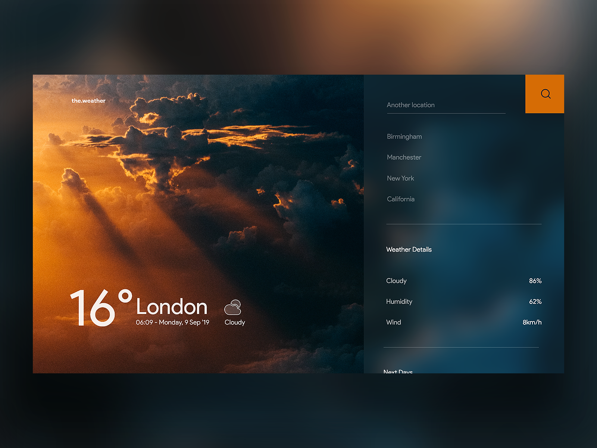

<h1 align="center">Hadad 🌥</h1>

## Table of Contents

- [Table of Contents](#table-of-contents)
- [Overview](#overview)
  - [Built With](#built-with)
- [Features](#features)
- [Resources](#resources)
- [Acknowledgements](#acknowledgements)
- [Author](#author)

## Overview
Hadad, also spelled Had, Hadda, or Haddu, the Old Testament Rimmon, West Semitic god of storms, thunder, and rain, the consort of the goddess Atargatis. His attributes were identical with those of Adad of the Assyro-Babylonian pantheon. 

What's the point? - None 😜
Just a cool weather app

[Checkout the demo](https://hadad-weather-blan.netlify.app/)

### Built With

<!-- This section should list any major frameworks that you built your project using. Here are a few examples.-->

- [HTML](https://developer.mozilla.org/en-US/docs/Web/HTML)
- [CSS](https://developer.mozilla.org/en-US/docs/Web/CSS)
- [JavaScript](https://developer.mozilla.org/en-US/docs/Web/JavaScript)

## Features

- [x] ⛈ **Current weather**
- [x] ⛩️  **Design** - Minimalist stunning design
- [x] 🌎 **Global** - show any city in the world
- [x] ⏱️  **Time & Date** - current time and date in the city
- [x] ✨  **Icons & background** - icons and background change depending the weather
- [x] 🗒️ **Weather details** - cloudy, humidity, wind, etc
 
## Resources
- [Box Icons](https://boxicons.com/?query=) - for search icon
- [Google fonts](https://fonts.google.com/) - for fonts
- [Weather API](https://www.weatherapi.com/) - api for all informations
- [Unsplash](https://unsplash.com/) - for backgrounds
- [Dribble](https://dribbble.com/) - for the design

## Acknowledgements

- **Fetch API** - Use Fetch to get data from an API
- Use an API on your application
- Display data from an API into your app
- Create a search bar, and search through the weather API for a specific city
- Create a beautiful glassmorphism app design with HTML & CSS
- Responsive Design with CSS
- Reformatting API data to something more suitable for the UI
- Working and manipulating strings in JS
- Using template literals in Javascript
- **Modify the DOM** - Conditionally changing the background image of the app based on current weather
- Catching errors when fetching from an API
- Basic CSS animations
  
## Author

Hadad is developed by [@Naveen](https://github.com/claymeers)</h1>